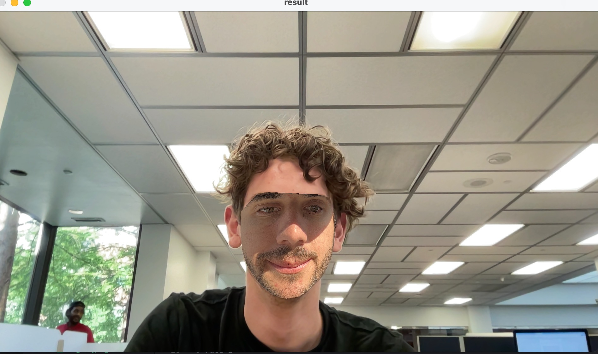
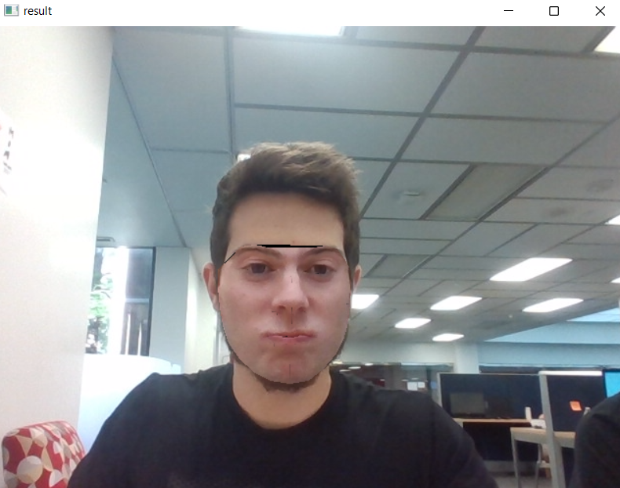

# **Exploring Beyond: Python and Computer Vision**

## **Purpose of this Project**
&nbsp;&nbsp;&nbsp;&nbsp;&nbsp;
This project has given us the opportunity to explore something new related to Machine Learning. We wanted to work on something cool and complete a project that we would make us proud. And what is cooler than Computer Vision? The rationale behind working with Computer Vision is mainly for exploratory and exposure reasons as we wanted to become familiar with some cool libraries and programs that use Computer Vision to make distinctions. In Dr. Fontenot's Algorithms class in Fall 2021, the final project was comprised of a completion of a series of LeetCode problems. The goal of this project was to help prepare ourselves for job interviews, problems posed in the real world, and just becoming more experienced programmers in general. We derived inspiration for this project with that idea in mind. We wanted to simply explore cool libraries and explore different ideas associated with Computer Vision. In our project, we completed 4 separate projects all pertaining to relatively different ideas. These include a face swapping program & real-time face swapping, shape detection & real-time shape detection, and a program to derive if a person is President Barack Obama or not.    
&nbsp;&nbsp;&nbsp;&nbsp;&nbsp;

## **Python Virtual Environments**

### **Windows**
&nbsp;&nbsp;&nbsp;&nbsp;&nbsp;
While setting up OpenCV and the Face Recognition module, we ran into multiple issues regarding the installation of these packages. Given the nature of exploring new areas of this project, we decided to understand the issues we were having and make sure that whoever tries to reproduce this has a clear guide on making sure it works properly. 
&nbsp;&nbsp;&nbsp;&nbsp;&nbsp;
Essentially, the purpose of virtual environments is to keep depencies separate from other projects. These depencies are installed through pip (the package installer for Python). Just running the pip command will install the package globally and, over time, python will have multiple packages together which can lead to some compatibility issues and mix-ups. It is difficult to keep track of all packages installed. 
&nbsp;&nbsp;&nbsp;&nbsp;&nbsp;
That is where virtual environments come into play. Each project has its own virtual environment which only contains the dependencies necessary for that project. That way, the reproducibility of projects greatly increase and the projects are also more lightweight when they only have relevant packages installed. 
&nbsp;&nbsp;&nbsp;&nbsp;&nbsp;
Below are the steps to install Python and the virtual environment from scratch on a Windows machine:

1. Download and Install [Python](https://www.python.org/downloads/) for Windows
   1. Click Add Python to PATH
   2. Type the following in a terminal to check if it is installed properly
      1. `python --version`
   3. Install virtual environment package
      1. `pip install virtualenv`
2. Clone this repository into a folder on your computer
3. **ONLY FOLLOW THE STEPS BELOW IF THERE IS NO .facevenv FOLDER IN THE ROOT FOLDER OF THIS REPOSITORY**
4. Open a command terminal inside the root folder
   1. Ctrl+L, type `cmd` and hit enter
5. Create virtual environment for this project
   1. Inside the command terminal type the following
   2. `python -m venv .facevenv`
6. Install necessary packages in the virtual environment
   1. Type `.facevenv\scripts\activate` in the command terminal
   2. Type the following commands:
      1. `pip install pandas`
      2. `pip install numpy`
      3. `pip install cmake`
      4. `pip install wheel`
      5. `pip install dlib`
      6. `pip install opencv-python`
      7. `pip install face-recognition`
7. Select .facevenv as the environment for this project in your IDE

### **MacOS**
&nbsp;&nbsp;&nbsp;&nbsp;&nbsp;
Below are the steps to install Python and the virtual environment from scratch on a MacOs machine. They are very similar to Windows except one line:

1. Download and Install [Python](https://www.python.org/downloads/) for Windows
   1. Click Add Python to PATH
   2. Type the following in a terminal to check if it is installed properly
      1. `python --version`
   3. Install virtual environment package
      1. `pip install virtualenv`
2. Clone this repository into a folder on your computer
3. **ONLY FOLLOW THE STEPS BELOW IF THERE IS NO .facevenv FOLDER IN THE ROOT FOLDER OF THIS REPOSITORY**
4. Open a command terminal inside the root folder
5. Create virtual environment for this project
   1. Inside the command terminal type the following
   2. `python -m venv .facevenv`
6. Install necessary packages in the virtual environment
   1. **Type `source .facevenv/bin/activate` in the command terminal**
   2. Type the following commands:
      1. `pip install pandas`
      2. `pip install numpy`
      3. `pip install cmake`
      4. `pip install wheel`
      5. `pip install dlib`
      6. `pip install opencv-python`
      7. `pip install face-recognition`
7. Select .facevenv as the environment for this project in your IDE

## **Fun Projects**
&nbsp;&nbsp;&nbsp;&nbsp;&nbsp;
As previously mentioned, this project has the goal of allowing us to explore topics on Computer Visions and learn how to do some cool implementations. To achieve this goal, we will work on several small projects that we found online and make some modifications on them as well as explain how each project works under the hood.

### **Obama/Not Obama**
&nbsp;&nbsp;&nbsp;&nbsp;&nbsp;
Inspired by the Hotdog/Not Hotdog program from "Silicon Valley", we decided to create a similar project: Obama/Not Obama. Instead of detecting hotdogs, our program detects faces in any given images and tells the user if that person is Obama or not.  
&nbsp;&nbsp;&nbsp;&nbsp;&nbsp;
The program uses [OpenCV](https://opencv.org) to read the image and then uses the [``face_recognition``](https://github.com/ageitgey/face_recognition) package to detect faces and identify them. This library uses [``dlib``](http://dlib.net)'s facial recognition algorithms, but is much easier to use. The dlib facial recognition network is based on ResNet-34 and it is already trained on a large dataset, called [Labeled Faces in the Wild (LFW)](http://vis-www.cs.umass.edu/lfw/). 
How to run Obama/Not Obama:
1. Upload any pictures you want the program to go through on the Your-Pictures folder located inside the Images folder
   1. AML-Final-Project\Images\Your-Pictures
2. Run the AreYouObama.py script from your virtual environment or your IDE
3. Respond if you want the program to work on a picture uploaded by you or on live camera
4. See the results
   1. If you are on live video, try pulling up a picture of Obama on your phone to the camera!
   2. To stop the live video, simply press Ctrl+C on the terminal
5. To end the program:
      1. For live video press q
      2. For uploaded pictures press anybutton to go to the next image

### **Face Swap**
Similar to the Obama project this uses OpenCV to read the image and recognize a face. Then uses dlib's trained facial recognition model that has 68 coordinates that maps a person face. I was inspired to do this project to make the most disturbing face swaps of my teammates as possible.
 
To run the non-live face swap:
1. Upload two pictures you want to use to the Your-Picutres folder located inside the Images folder
2. Paste the path of the photos to the photos_face_swapping.py file located in the projects folder
   1. There are comments indicated where to input each photo
3. Then run the script and the photo should appear
 
To run the live face swap:
1. Upload one photo you want to use to the Your-Pictures folder located inside the Images folder
2. Paste the path of the photo to the realtime_face_swapping.py script
3. Run the script and prepare your eyes for what you will see

Notes: This script is pretty buggy and will crash if the camera takes in too much data. Also the only way to terminate the program is by going to the terminal and pressing command + c

 

### **Live Face Recognition**
&nbsp;&nbsp;&nbsp;&nbsp;&nbsp;
Give training set of your pictures (and Obama's), turn on webcam, tells who you are live

### **Hand Gesture Reader 0-5**
&nbsp;&nbsp;&nbsp;&nbsp;&nbsp;*
Give training set from kaggle, open webcam, reads number on your hand
https://www.kaggle.com/datasets/shirleylizz/hand-gestures-of-digits-from-0-to-5

